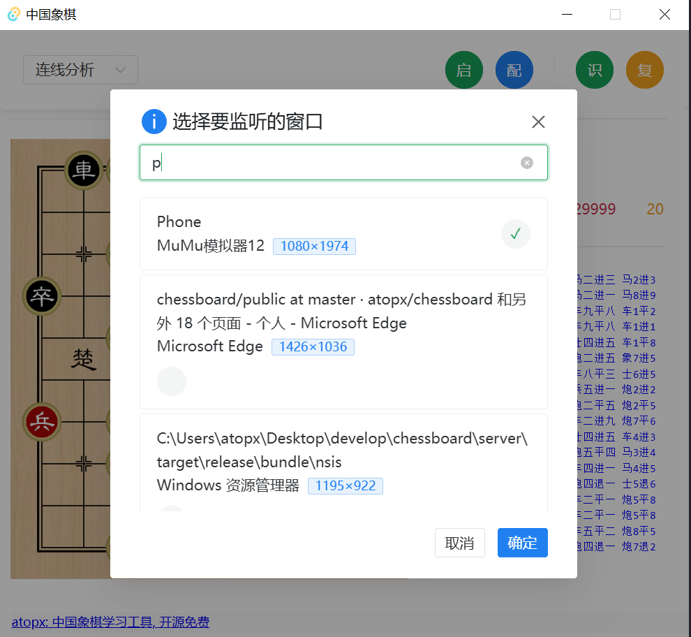
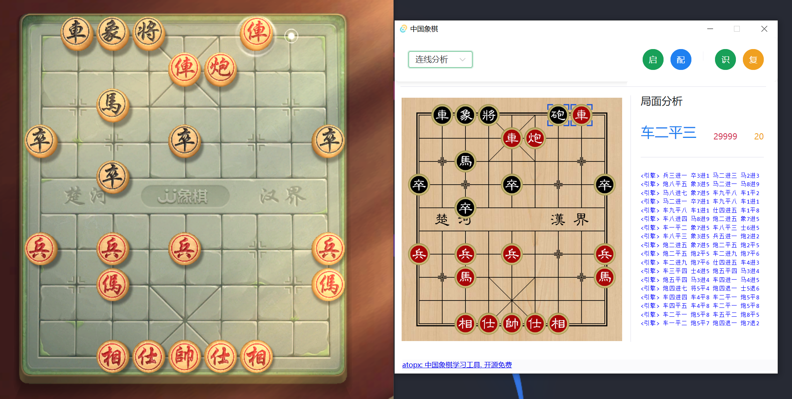
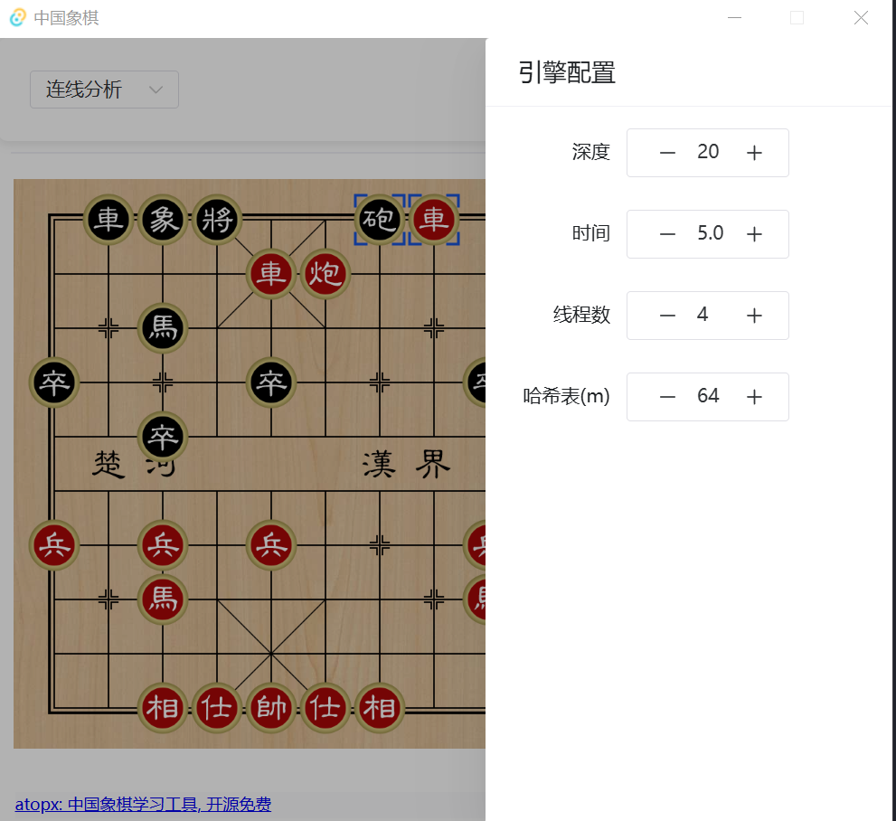
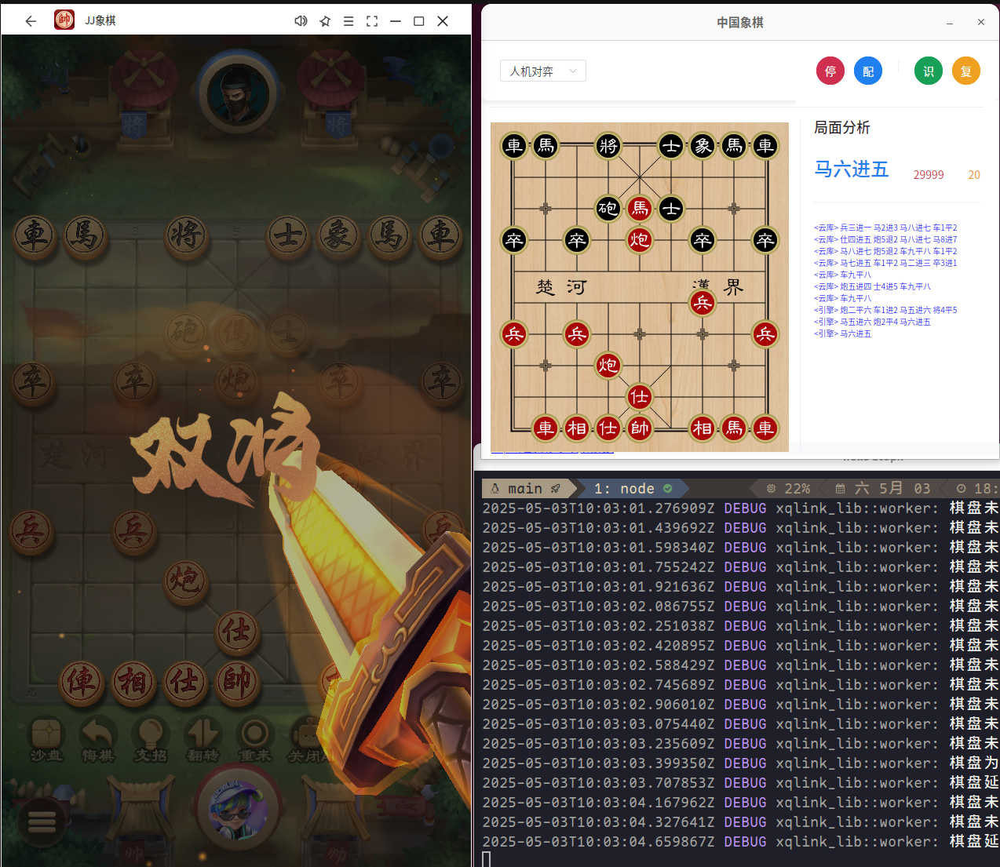

# Chinese-Chess-Max

中国象棋Max：屏幕棋盘实时识别 + 引擎分析 + 中文招法建议（开源免费）

## 项目简介

“Chinese-Chess-Max”是一款中国象棋学习/分析助手。通过实时识别屏幕中的棋盘局面，结合高性能引擎分析建议，为在线对战平台的玩家提供精准走法参考与策略指导，帮助象棋爱好者快速提升棋艺水平。

## 下载安装

[点击查看 Release](https://github.com/lza6/Chinese-Chess-Max/releases/latest)

> ⚠️ **当前状态**：Release 提供 **Web 静态构建（dist.zip）**；桌面安装包（MSI/deb）依赖
> `libs/large.onnx`（YOLOv8 模型）与 onnxruntime 运行时资源，补齐后由 CI 自动产出。
> 详见 [docs/VERIFICATION-LOG.md](./docs/VERIFICATION-LOG.md) 的“诚实边界”。

## ✨ 功能状态（诚实矩阵）

| 功能 | 状态 | 说明 |
|---|---|---|
| ⚡ 屏幕棋盘识别 | ✅ 已实现 | YOLOv8 + ONNX Runtime；模型 `libs/large.onnx` 需本地补齐后才可运行 |
| 🤖 Pikafish 引擎分析 | ✅ 已实现 | 深度/时间/线程/哈希可配置 |
| 🀄️ 中文招法展示 | ✅ 已实现 | 实时最佳招法 + 评分 + 日志 |
| 📚 云库查询（chessdb.cn） | ✅ 已实现 | 开局库数据源；可在配置中开关 |
| 🖼️ 图片识别 | 🕓 开发中 | 按钮已占位，未接线 |
| 📋 复制局面 | 🕓 开发中 | 按钮已占位，未接线 |
| ♟️ 人机对弈 / 连线对战 | 🕓 未实现 | 产品决策后按 Spec Kit 流程实现 |
| 🚀 GPU 加速 | 🕓 待验证 | 代码支持 CUDA/DirectML/CoreML，需目标机型实测；仅加速识别，引擎始终 CPU |

## 🎯 核心功能

- 📷 **实时棋盘识别**  
  基于 YOLOv8 与 ONNX Runtime，精准定位与分类棋子，自动捕捉对局状态。
- 🤖 **智能走法分析**  
  集成 Pikafish 象棋引擎，提供深度搜索与多变策略，支持分析深度和线程数自定义。  
- 🀄️ **中文招法展示**  
  将专业分析结果转为易读的中文走法描述，让开局、布局一目了然。  
- 📚 **开局库支持**  
  接入经典开局库，实时给出理论指导，助你构建坚实布局。  

## 🏗 技术架构

### 前端
- **框架**：Vue 3 + TypeScript  
- **UI 组件**：Naive UI  
- **桌面发行版**：Tauri 2（轻量化跨平台打包）

### 后端
- **编程语言**：Rust  
- **棋盘识别**：YOLOv8 + ONNX Runtime  
- **象棋引擎**：Pikafish（高性能中国象棋引擎）  
- **应用通信**：Tauri API

## 🚀 快速上手

1. `pnpm install && pnpm dev` 启动前端开发环境（或使用 Release 的 Web 构建）
2. 点击“启”按钮，在弹窗中选择要监听的**对局窗口**
3. 工具自动识别棋盘并启动引擎分析
4. 右侧面板实时展示最佳走法、评分、深度与日志
5. 点击“配”调整深度/时间/线程/哈希/云库参数

> 桌面完整版需 `libs/large.onnx` 与引擎资源：详见 [docs/SOP.md](./docs/SOP.md)。

## 📸 应用截图

  
  

##### Linux

## 🔄 CI/CD

持续集成与持续交付（CI/CD）配置说明见 [docs/CI-CD.md](./docs/CI-CD.md)。

### 📚 项目文档
- [SPEC.md](./docs/SPEC.md) 项目规格与验收基线
- [SPEC-V2.md](./docs/SPEC-V2.md) 本轮增量规范（Spec Kit）
- [REQUIREMENT-MATRIX.md](./docs/REQUIREMENT-MATRIX.md) 需求追踪矩阵
- [AUDIT-V2.md](./docs/AUDIT-V2.md) 深度审计问题清单
- [SELF-REVIEW.md](./docs/SELF-REVIEW.md) 反向审判
- [CONTRACT.md](./docs/CONTRACT.md) 前后端 Tauri 命令/事件契约
- [SOP.md](./docs/SOP.md) 从零跑通→发布→回滚 Runbook
- [SCALABILITY-REVIEW.md](./docs/SCALABILITY-REVIEW.md) 可扩展性适用性审查
- [VERIFICATION-LOG.md](./docs/VERIFICATION-LOG.md) 验证日志/记忆点

## 🛠 开发计划

- [x] 基础棋盘识别（代码就绪，模型待补齐）
- [x] 引擎分析集成
- [x] 中文招法展示
- [x] 可视化配置界面
- [x] 云库查询
- [ ] 图片识别
- [ ] 复制局面
- [ ] 对局数据导出
- [ ] 人机对战 / 连线对战
- [ ] 自研轻量 AI 引擎接入

## 📜 许可声明

本项目基于 MIT License（[LICENSE](./LICENSE)），永久免费开源。

